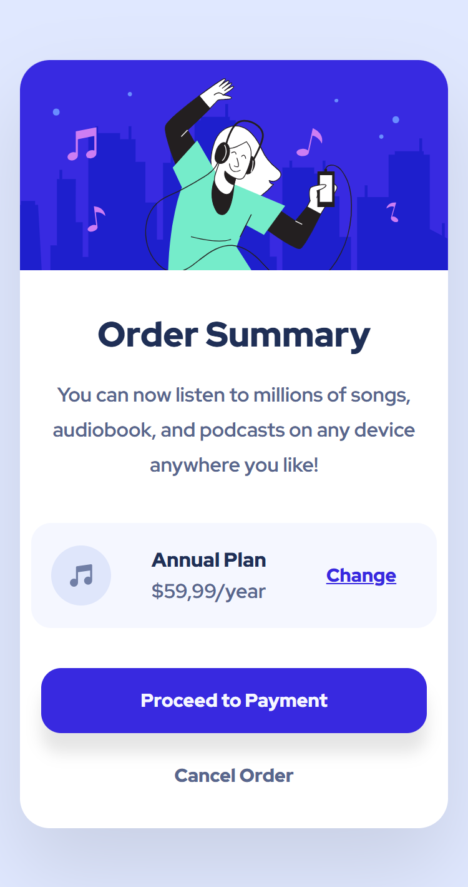
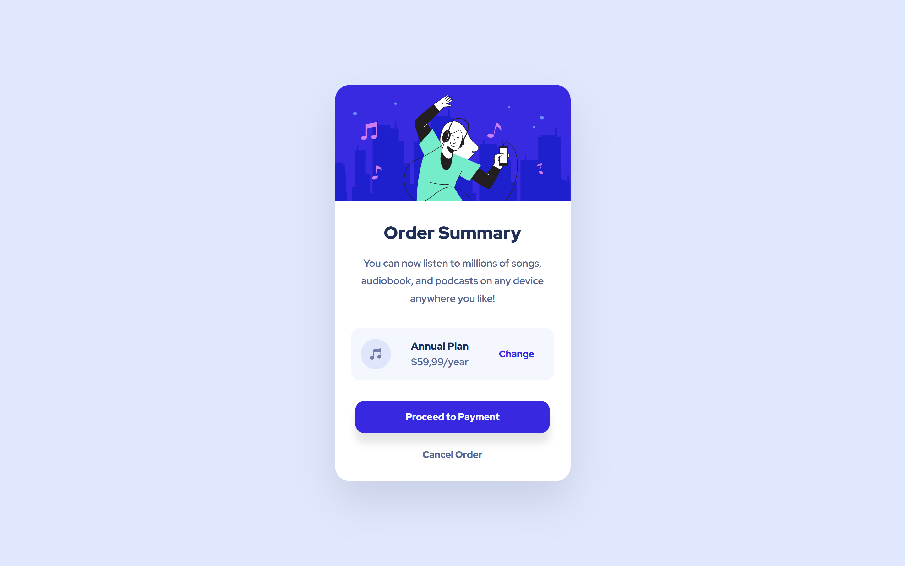

# Frontend Mentor - Solução de Order Summary Component

Esta é uma solução para o [desafio Order Summary Component do Frontend Mentor](https://www.frontendmentor.io/challenges/order-summary-component). Os desafios do Frontend Mentor ajudam você a aprimorar suas habilidades de codificação construindo projetos realistas.

## Sumário

- [Visão geral](#visão-geral)
  - [Captura de tela](#captura-de-tela)
  - [Links](#links)
- [Meu processo](#meu-processo)
  - [Ferramentas utilizadas](#ferramentas-utilizadas)
  - [O que aprendi](#o-que-aprendi)
  - [Desenvolvimento futuro](#desenvolvimento-futuro)
  - [Recursos úteis](#recursos-úteis)
- [Autor](#autor)

## Visão geral

## O desafio

Os usuários devem ser capazes de:

- Ver estados de hover nos elementos interativos
- Visualizar o layout ideal do componente conforme o tamanho da tela do dispositivo
- Navegar pela interface usando apenas o teclado (acessibilidade)
- Experimentar rolagem suave e respeitar preferências de movimento reduzido (acessibilidade)

### Captura de tela

| Mobile                                    | Desktop                                     |
| ----------------------------------------- | ------------------------------------------- |
|  |  |

### Links

- URL da solução: [https://github.com/Davilla07/Order-Summary-Component](https://github.com/Davilla07/Order-Summary-Component)
- URL do site ao vivo: [https://davilla07.github.io/Order-Summary-Component](https://davilla07.github.io/Order-Summary-Component)

## Meu processo

### Ferramentas utilizadas

- HTML5 semântico
- Variáveis CSS (Design System)
- Metodologia BEM para arquitetura CSS
- Flexbox e CSS Grid para layout
- Workflow mobile-first
- Abordagem focada em acessibilidade (compatível com WCAG AA)

### O que aprendi

Este projeto foi um marco no meu desenvolvimento front-end. Destaco os principais aprendizados:

**♿ Acessibilidade como prioridade, não como "extra":**

```css
/* Respeitar preferência do usuário por movimento reduzido */
@media (prefers-reduced-motion: reduce) {
  *,
  *::before,
  *::after {
    transition-duration: 0.01ms !important;
    animation-duration: 0.01ms !important;
  }
}

/* Focus visible apenas para navegação por teclado */
.btn:focus-visible {
  outline: 2px solid var(--blue-700);
  outline-offset: 2px;
}
```

## Desenvolvimento futuro

**Próximos focos de aprendizado baseados neste projeto:**

- Interatividade com CSS puro: Explorar o "checkbox hack" para criar accordions e modais sem JavaScript
- Animações avançadas: Aprender @keyframes e will-change para micro-interações performáticas
- Testes de acessibilidade: Integrar axe-core ou Lighthouse CI no fluxo de desenvolvimento
- Dark mode: Implementar tema escuro usando @media (prefers-color-scheme)
- Performance: Aprofundar em Critical CSS, lazy loading e otimização de assets

## Recursos úteis

- Frontend Mentor - Desafios reais com design profissional. A melhor forma de praticar.
- WebAIM Contrast Checker - Validação rápida de contraste para WCAG.
- MDN: Propriedades Customizadas CSS - Documentação essencial para dominar variáveis CSS.
- Checklist do A11y Project - Guia prático de acessibilidade para consultar durante o desenvolvimento.
- Can I use - Verificar suporte de features CSS em diferentes navegadores.

## Autor

- Frontend Mentor - @Davilla07
- GitHub - @Davilla07
